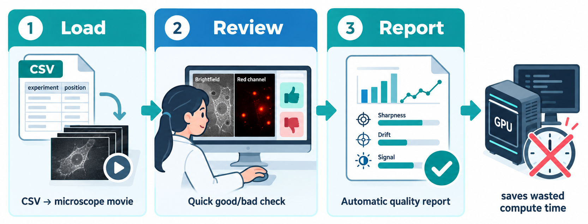

# pre-qc




## Install (macOS — click-through app)

Requires **Python 3.10+** (napari doesn't support older). If your default
`python3` is older, install a newer one first (e.g. `brew install
python@3.11`); `scripts/install.sh` picks it up automatically.

**Private repo — any BoeckLab org member already has read access.** If you
don't have a GitHub SSH key registered yet:

```bash
ssh -T git@github.com   # if this fails with "Permission denied (publickey)":
ssh-keygen -t ed25519 -C "your.email@unibas.ch"
eval "$(ssh-agent -s)"
ssh-add ~/.ssh/id_ed25519
cat ~/.ssh/id_ed25519.pub   # paste at github.com -> Settings -> SSH and GPG keys
```

Then clone and install:

```bash
git clone git@github.com:BoeckLab/pre-qc.git
cd pre-qc
bash scripts/install.sh
```

This clones (or updates) `~/pre-qc`, builds an isolated venv there, and
installs **QC.app** into `/Applications` — one shared app identity/icon for
the whole qc/ suite (pre-qc now; post-qc once it exists at `~/post-qc`,
at which point the same app picks between them). It's a thin launcher
(not a frozen binary) that does nothing but run `pre-qc` directly in place
of itself — no separate Terminal window, no interactive step before that
handoff — so there's only ever one icon/process for the whole thing, the
same way cell-slate's own launcher works; `pre-qc` itself asks which CSV to
review via a native file dialog once napari is already up. After this,
**open it from `/Applications` or the Dock** like any other app — no
Terminal needed again for routine use (right-click its Dock icon →
**Options** → **Keep in
Dock** to pin it).

To pick up updates later: re-run `bash scripts/install.sh`, or `cd
~/pre-qc && git pull && source .venv/bin/activate && pip install -e .`.

**If you installed before the switch from PyQt5 to PyQt6** (napari is
deprecating PyQt5 support), `pip install -e .` alone won't remove the old
PyQt5 install from an existing venv — delete and rebuild it instead:
`rm -rf ~/pre-qc/.venv && bash scripts/install.sh`.

## Install (terminal — Linux/other, or macOS without the click-through app)

Requires **Python 3.10+** (napari doesn't support older). Check what you
have:

```bash
python3 --version
```

If it's older than 3.10, install a newer interpreter first — e.g. on
Ubuntu/Debian: `sudo apt install python3.11 python3.11-venv`; on macOS:
`brew install python@3.11`.

**1. One-time SSH key, if you don't already have one registered with
GitHub** (private repo — any BoeckLab org member already has read access):

```bash
ssh -T git@github.com
```

If that prints `Hi <username>! You've successfully authenticated...`, skip
to step 2. If it says `Permission denied (publickey)`:

```bash
ssh-keygen -t ed25519 -C "your.email@unibas.ch"
eval "$(ssh-agent -s)"
ssh-add ~/.ssh/id_ed25519
cat ~/.ssh/id_ed25519.pub
```

Paste the printed key at **github.com → Settings → SSH and GPG keys → New
SSH key**, then re-run `ssh -T git@github.com` to confirm it worked.

**2. Clone and install into a virtual environment:**

```bash
git clone git@github.com:BoeckLab/pre-qc.git
cd pre-qc
python3.11 -m venv .venv        # or whichever 3.10+ interpreter you have
source .venv/bin/activate
pip install --upgrade pip
pip install -e .
```

**3. Run it** (see "Input CSV" below for the CSV format; `EXP`
needs to resolve to something locally readable from wherever you run this —
see "Accessing experiment data from sciCORE" if your movies live there):

```bash
pre-qc wells_to_check.csv
```

**4. Routine use after the first install** — just re-activate the venv,
no reinstall needed unless you want to pick up updates:

```bash
cd pre-qc && source .venv/bin/activate && pre-qc wells_to_check.csv
```

To pick up updates: `git pull && pip install -e .` inside that same venv.

(Standalone project — no dependency on `cell-slate` or `HiTMicTools`,
deliberately, so it's a light install for someone who hasn't set either up
yet.)

## Accessing experiment data from sciCORE

`EXP` in the input CSV must be a path that's locally readable
from wherever `pre-qc` runs — there's no built-in SSH/S3 support, pre-qc
only ever opens local files. **Don't run pre-qc itself on a sciCORE login
node** (interactive GUI apps don't belong there, and X11-forwarded napari
rendering is too laggy for real use anyway) — install it on your own
machine and bring the data to it, one of:

**A. SSHFS mount (persists across reboots without re-authenticating each time):**

```bash
# Linux:
sudo apt install sshfs
# macOS:
brew install macfuse && brew install gromgit/fuse/sshfs-mac   # macFUSE broke Homebrew's official sshfs cask; this tap has a working build

mkdir -p ~/scicore
sshfs <username>@login-node.scicore.unibas.ch:/scicore/home/boeluc00/<username> ~/scicore -o volname=scicore
```

(macOS: first install needs a one-time approval in **System Settings →
Privacy & Security**, sometimes needs a reboot to fully take.) Once
mounted, point `EXP` at e.g. `~/scicore/experiment_042`.
Unmount when done: `umount ~/scicore` (or `fusermount -u ~/scicore` on
Linux).

**B. macOS only — Finder's "Connect to Server" (no terminal, no install):**

Press **⌘K** in Finder, enter `smb://toucan-all.scicore.unibas.ch/RINFsci$`,
log in with your sciCORE credentials. Mounts under `/Volumes/RINFsci$`.

**C. Off-campus / one-off — rsync a copy locally:**

```bash
rsync -avP <username>@login-node.scicore.unibas.ch:/path/to/experiment_042/ ~/local_qc_data/experiment_042/
```

Then point `EXP` at `~/local_qc_data/experiment_042`.

**JetRaw-compressed files (`.ome.p.tiff`) can't be opened by pre-qc at all**
— see "Before you start: compressed files" below for the decompress-first
workflow.

## Input CSV

**One shared `EXP` for the whole experiment, one row per well/frame inside
it.** `EXP` is the *single top-level folder* that holds every movie for
that experiment — it's the same value repeated down the column, not a
different folder per row. `WELL` is the well label (letter + number, e.g.
`A1`, `A12`) and `FRAME` is the field-of-view/position token within that
well (e.g. `p01`) — pre-qc finds the one file under `EXP` whose name
contains *both* `WELL` and `FRAME` (real acquisition filenames always carry
both), so you don't need to know or write out each movie's actual
filename.

Copy [`templates/wells_to_check_template.csv`](templates/wells_to_check_template.csv)
and fill in your own path/wells/frames rather than writing one from scratch:

```csv
EXP,WELL,FRAME,COND
/scicore/projects/rinfsci/<you>/<your_experiment_folder>,A1,p01,control
/scicore/projects/rinfsci/<you>/<your_experiment_folder>,A2,p01,treatment
/scicore/projects/rinfsci/<you>/<your_experiment_folder>,A12,p01,control
/scicore/projects/rinfsci/<you>/<your_experiment_folder>,B3,p01,treatment
```

(All four rows point at the *same* `EXP` — only `WELL`/`FRAME` change row
to row. If you're checking wells across more than one experiment, just
repeat the pattern with a different `EXP` value for that experiment's own
rows — the experiment-level trash/keep decision and the master decisions
log, see below, are both keyed on this value.)

- `EXP`, `WELL` and `FRAME` are required; any extra columns (e.g. a
  human-readable `COND`) are carried through untouched into the results
  sidecar, and shown/used to label movies in the report instead of their
  full file paths.
- The movie file is found by searching under `EXP` for a file whose name
  contains both `WELL` and `FRAME` — no fixed naming convention is assumed
  beyond that, so this works across different acquisition layouts. If that
  match is ambiguous (more than one file) or missing, the row is flagged
  rather than guessed at.
- Any **uncompressed** format works: `.nd2`, `.ome.tiff`/`.ome.tif`, plain
  `.tiff`/`.tif`. JetRaw-compressed `.ome.p.tiff`/`.p.tif` files are
  rejected with a pointer to decompress first (see BacNets'
  `ONBOARDING_JETRAW.md`) — QC is meant to run on exactly what the
  pipeline will see, and JetRaw decoding needs a licensed SDK only set up
  on sciCORE.

### Choosing which wells/frames to review

You don't need to review every well in a plate — a representative subset
is enough to decide whether the experiment is usable:

- Cover **10–15 conditions** across the plate.
- Include **2 conditions expected to kill** (positive control for the
  PI/fluorescence channel actually working).
- Include **1 growth-control condition** (confirms the baseline is
  healthy).
- For **2 wells, review every frame/FOV** in that well (catches
  within-well variability a single frame would miss).
- For the remaining wells, one **representative frame per condition and
  plate position** is enough (e.g. a corner and a center well, not just
  whichever is first alphabetically).

## Before you start: compressed files

pre-qc only reads **uncompressed** movies. If any movie in your CSV
points at a JetRaw-compressed file (`.ome.p.tiff`/`.p.tif`), it can't be
opened here — JetRaw needs a licensed SDK that's only set up on sciCORE,
never on a laptop. Run this pre-run check **on sciCORE** once your CSV is
filled in, so compressed files get caught and fixed up front instead of one
at a time mid-review:

1. **Install and configure `jetraw-tools` once** (one-time per sciCORE
   account — skip if already done): see BacNets' `ONBOARDING_JETRAW.md`
   sections 1–2.

2. **Check every row in your CSV, decompressing only what's actually
   compressed** (leaves already-uncompressed files untouched, and tells you
   exactly which rows are missing a file entirely):
   ```bash
   # on sciCORE, from any directory, with your jetraw-tools venv active
   CSV=wells_to_check.csv
   tail -n +2 "$CSV" | while IFS=',' read -r exp well frame _; do
     plain=$(find "$exp" -iname "*${well}*" \
       \( -iname "*.tif" -o -iname "*.tiff" -o -iname "*.nd2" \) 2>/dev/null \
       | grep -v -E '\.p\.tiff?$' | grep -F "$frame")
     if [ -n "$plain" ]; then
       echo "OK (already uncompressed): ${well}/${frame}"
       continue
     fi
     compressed=$(find "$exp" -iname "*${well}*" \
       \( -iname "*.p.tiff" -o -iname "*.p.tif" \) 2>/dev/null | grep -F "$frame")
     if [ -z "$compressed" ]; then
       echo "MISSING: no file found for ${well}/${frame} under $exp"
       continue
     fi
     out="${compressed%.p.tiff}.tiff"
     echo "Decompressing ${well}/${frame}: $compressed -> $out"
     python ~/scripts/decompress_jetraw.py "$compressed" "$out"
   done
   ```
   This loop is read-only for anything already uncompressed — rerunning it
   is always safe, it just reports "OK" for rows that don't need work.
3. **Bring the plain `.tiff`/`.nd2` output over** to wherever you'll run
   pre-qc (see "Accessing experiment data from sciCORE" above) — same
   folder layout, so your CSV's `EXP`/`WELL`/`FRAME` still resolve.
4. **Then launch pre-qc.** If a row still can't be resolved (still
   compressed, wrong path, ambiguous match), it's flagged in the terminal
   and in the app rather than crashing the whole review.

## Run

```bash
pre-qc wells_to_check.csv
```

The CSV argument is optional — run `pre-qc` with no argument at all (which
is what **QC.app** does) and napari opens straight into an idle **QC
review** dock with nothing loaded yet. From there, either the native file
dialog that pops up on first launch, or the **Load CSV…** button inside the
dock at any later point, picks a CSV to review. Loading a CSV while another
one is mid-review (or already finished) fully switches to the new
experiment — cleared image layers, a fresh review position, a fresh
trash/keep suggestion — it never merges the two.

Once a CSV is loaded:

1. Scroll frames with napari's own slider (channels show as separate,
   additively-blended layers). A movie can take a while to load, especially
   over a network mount — a "Loading movie: ‹path›" popup stays up the
   whole time so it's clear the app is still working, not stuck. Once
   loaded, the movie's `COND` (or `WELL`/`FRAME` if the CSV has no `COND`
   column) is overlaid top-left on the napari canvas itself, so it's
   obvious what you're looking at without glancing at the dock.
2. Mark the current movie **GOOD** (key `g`) or **BAD** (key `b`) — this
   saves immediately to `<input>_qc_results.csv`. Quitting partway through
   and re-running on the same CSV resumes from where you left off instead
   of restarting. An optional note can be typed any time and persisted on
   its own with the **Save** button, without needing to also (re-)mark
   good/bad.
3. Set a **Q / NQ / X** post-QC label on the current movie (quantifiable /
   not quantifiable / needs a second look) — independent of GOOD/BAD, meant
   for a *kept* experiment where most movies are fine but a few individual
   ones aren't worth including in downstream analysis. Also saved
   immediately to the sidecar, as `LABEL`. **Marking a movie GOOD does not
   auto-advance until it also has a label** — BAD movies advance right
   away (there's nothing to label), but a GOOD one without Q/NQ/X yet stays
   put so it can't get skipped unlabeled; setting the label is what moves
   on to the next row.
4. Once every resolvable row is marked good, **Finish** computes cheap
   CPU-only analyzability metrics and writes `<input>_qc_report.html` +
   `<input>_qc_metrics.csv`, then opens the HTML report in your browser
   automatically. If any row is still bad or unreviewed, Finish refuses to
   run until that's resolved. The report includes a per-metric comparison
   plot — every movie's full per-frame curve overlaid in its own color on
   the same axes (not just a medians bar chart), so you can directly see
   e.g. which movie drifted more or lost focus earlier than the others —
   plus a per-movie BF intensity histogram (see "What 'analyzability'
   means here" below) to judge cell-vs-background density at a glance.

### Experiment decision — TRASH / KEEP

Separately from individual movies, decide whether the **whole experiment**
is usable. The dock shows a suggestion computed from the good/bad calls
above (any BAD movie → suggested TRASH; all GOOD → suggested KEEP), plus
the most recently recorded decision for this `EXP` if there is one — but
the decision itself is always a deliberate **Keep experiment** / **Trash
experiment** button click, never auto-applied. Clicking either appends one
row to a single, shared, append-only log at `experiment_decisions.csv` in
the repo root (never overwritten — every click adds another line, so the
full history of decisions across every experiment ever reviewed stays
intact), recording `EXP`, `decision`, a timestamp, and the good/bad/Q/NQ/X
counts at the time.

A **Tutorial** button (always visible, next to Check for Updates) opens this
README on GitHub in your browser — the same place a colleague you've shared
the repo link with would land.

### Left dock column

Below napari's own layer controls/layer list, the left column stacks three
more panels:

- **Histogram BF** / **Histogram FL** — a live pixel-intensity histogram of
  whichever frame is currently on screen, one per channel, redrawn as you
  scrub frames or switch movies. The same cells-vs-background density read
  as the post-hoc report's histogram (see below), just interactive instead
  of only generated once at Finish.
- **QC checklist** — a reference list of what to actually look for when
  deciding good vs. bad (focus, drift, PI signal, saturation, artifacts,
  empty fields, unexpected overgrowth/no-growth for a known condition,
  missing channels, frame-count mismatches, unusably low density). Read-only
  in the app; see `checklist.py` to edit the list itself as colleague
  feedback comes in.

Five panels (those three plus napari's native layer controls and layer
list) don't all fit comfortably full-height at once — a **Panels** list of
dropdown-style toggles (▸ collapsed / ▾ expanded) collapses whichever isn't
needed right now, independently of the others.

## What "analyzability" means here

Deliberately **not** a run of the real segmentation model — that would
partly defeat the point of checking before spending GPU hours. Instead,
fast, CPU-only proxies computed directly on pixels, split by channel
(channel 0 = brightfield/BF, channel 1 = PI/fluorescence — the BF-then-FL
convention used elsewhere in the lab's pipelines; PI metrics are skipped for
single-channel movies):

**Brightfield (channel 0):**
- **sharpness** — variance-of-Laplacian per frame; low/falling values flag
  out-of-focus acquisition.
- **mean intensity / contrast** — flags a too-dark, blown-out, or
  flat/low-contrast acquisition.
- **drift** — frame-to-frame phase-cross-correlation shift, accumulated;
  large cumulative drift flags a stage/focus problem that will confuse
  tracking.
- **foreground fraction** — rough Otsu-threshold coverage, not a cell
  count; flags empty wells (~0) or fully confluent/unsegmentable fields
  (~1).
- **BF intensity histogram** — pixel-intensity histogram summed over every
  frame, with that movie's median Otsu cells/background split drawn as a
  vertical line. A quick visual density check: a single narrow peak with no
  separate bump on either side of the line usually means an empty or
  fully saturated/confluent field, while two distinguishable humps mean
  cells genuinely stand out from background.
- **density class** — the same foreground-fraction number bucketed into
  `sparse/empty`, `moderate`, or `dense/confluent`, shown in the report
  table as a one-glance "is this movie dense or not" call.

**PI / fluorescence (channel 1):**
- **mean intensity** — flags a channel that's effectively all-dark (wrong
  filter cube, laser off, bad exposure) rather than a real all-negative
  biological result.
- **signal ratio** (99th-percentile / median intensity) — a
  segmentation-free contrast proxy; near 1 means no bright signal stands
  out above background at all, well above 1 means real dynamic range
  exists for PI+ cells to be distinguishable.
- **p95** (95th-percentile intensity) — a direct brightness percentile,
  less sensitive to a handful of hot/dead pixels than a true max, and less
  sensitive to overall exposure than mean intensity.
- **SNR** ((Otsu-foreground mean − Otsu-background mean) / Otsu-background
  std) — a standard microscopy signal-to-noise definition, distinct from
  signal ratio: this one is background-noise-aware, so it also flags a
  channel with fine dynamic range but too much background noise to
  actually segment PI+ cells from.
- **positive fraction** — rough Otsu-threshold coverage on this channel,
  analogous to BF's foreground fraction; not a real PI+ classification.

**Both channels:**
- **saturation** — fraction of pixels at the dtype's max value, tracked per
  channel; high values flag clipping/overexposure.

These are heuristic proxies for "will the real pipeline have something to
work with", not a guarantee of downstream pipeline quality.

## Keeping it up to date

The **Check for Updates** button (always visible, below the main review
controls) does a quick `git fetch` against GitHub and, if your install is
behind, offers to update: `git pull --ff-only` + `pip install -e .` into the
same venv, then automatically closes and reopens the app (`open -a "QC"`,
so this only self-relaunches when installed via `scripts/install.sh`'s
click-through app — a terminal-only install just needs to be re-run by
hand after the pull). Any in-progress review is already saved continuously
to the `_qc_results.csv` sidecar, so nothing is lost by the restart.

## Layout

```
pre-qc/
├── pyproject.toml
├── README.md
├── experiment_decisions.csv  # shared, append-only TRASH/KEEP log across every experiment (gitignored, created on first decision)
├── scripts/
│   └── install.sh   # macOS one-time: clone/venv/pip install -e . + generates /Applications/QC.app
├── templates/
│   └── wells_to_check_template.csv  # copy + fill in -- see "Input CSV"
├── src/pre_qc/
│   ├── io.py        # uncompressed-movie loading (nd2 + tiff/ome-tiff), WELL+FRAME path resolution
│   ├── manifest.py  # CSV manifest, crash-safe good/bad/Q-NQ-X progress tracking, decisions log
│   ├── metrics.py   # per-channel (BF/PI) sharpness/drift/saturation/intensity/signal-ratio/histogram proxies
│   ├── report.py    # static HTML + CSV report (matplotlib plots, base64-embedded, auto-opened)
│   ├── widget.py     # napari dock widgets: QC review (load/scroll/mark/label/decide/Finish/Tutorial/Updates) + checklist + panel toggles
│   ├── histogram_widget.py # live per-frame BF/FL intensity histogram panel (left dock column)
│   ├── checklist.py # plain-data list of good/bad review criteria shown in the checklist panel
│   ├── updater.py   # git fetch/pull + pip reinstall, backing the update button
│   ├── app.py       # CLI entry point (`pre-qc [csv]` -- csv optional, can load later from the app)
│   └── assets/
│       ├── qc_icon.png      # shared app icon -- same one post-qc will use
│       ├── qc-banner.png        # top-of-dock banner inside the app (transparent background)
│       ├── qc-banner-readme.png # same banner, solid black background, used in this README
│       └── qc-workflow.png      # workflow diagram used in this README
└── tests/
    └── test_pre_qc.py  # io/manifest/metrics logic (no napari/Qt needed)
```
